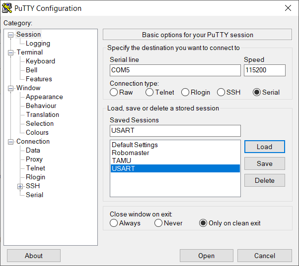
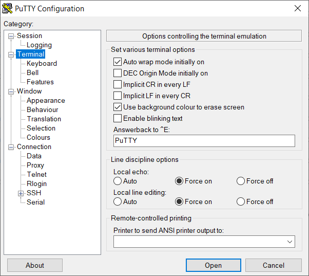

# Getting Started

1. Compile the code.

2. Download the code to the development board.

3. Use a USB to TTL UART Converter to connect the board and your computer. Note the pin connections.

    | Pin on the dev board	| Pin on the converter 	|
    |------------------------	|----------------------	|
    | RX                     	| TX                   	|
    | TX                     	| RX                   	|

4. Identify the COM/serial port that identifies the development board. On Windows, you can use Device Manager.

5. Install Putty. Use the following pictures to change Putty settings.

    Set the communication parameters:

    

    Set the display parameters:

    

# Commands You Can Play With

1. Any string starts with **r**. The response will be **Key r is pressed\r\n**.

2. Any string starts with **s**. The response will be **Key s is pressed\r\n**.

3. Only type and send one character at one time. You will also notice that one LED on the development board turns on and off when one character is received successfully by the board.

Happy hacking!